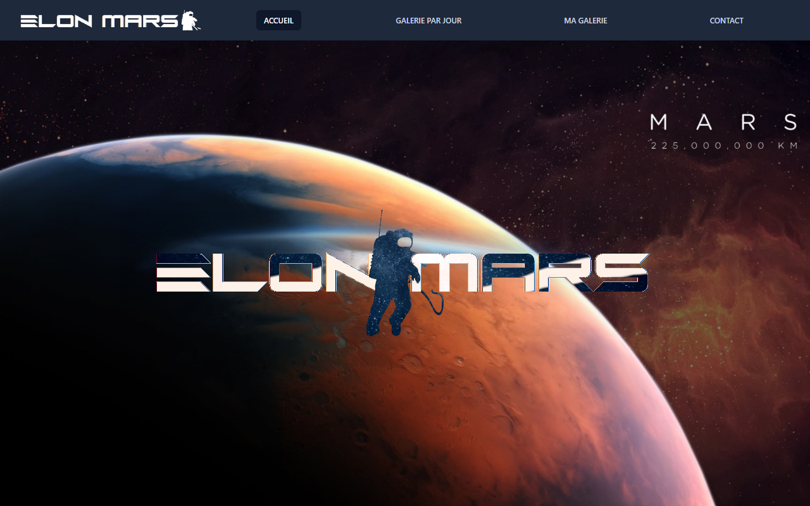

# Elon Mars

Galerie de photos de Mars prises par le rover Curiosity, faite en Angular avec l'API de la NASA.
Projet réalisé pendant ma formation (2022).

Site en ligne : [e-lonmars.netlify.app](https://e-lonmars.netlify.app/)



## Fonctionnalités

- **Galerie par jour** : on choisit une date dans un calendrier et l'application affiche les photos prises par Curiosity ce jour-là.
- **Ma galerie** : on ajoute ou retire une photo de ses favoris d'un clic. Les favoris sont enregistrés dans le navigateur (localStorage) et restent après un rechargement.
- **Contact** et **page d'erreur** pour les adresses inconnues.
- Mise en page responsive (ordinateur, tablette, mobile).

## État du projet

L'API Mars Rover Photos de la NASA ne répond plus (erreur 404 en 2026).
Les galeries s'affichent donc vides, mais le reste du site fonctionne.

## Technologies

- Angular 13 et TypeScript
- RxJS et HttpClient pour les appels à l'API
- Angular Material (calendrier), Tailwind CSS, Font Awesome
- ESLint

## Ce que j'ai appris

- Découper une application en composants, pages et services.
- Appeler une API REST avec `HttpClient` et les `Observable`.
- Gérer la navigation avec le routeur Angular (routes, redirection, page 404).
- Écrire un service générique pour lire et écrire dans le localStorage.

## Lancer le projet en local

Prérequis : Node.js 16 (version compatible avec Angular 13).

```bash
npm install
npm start
```

Puis ouvrir http://localhost:4200.

Le projet utilise `DEMO_KEY`, la clé publique de démonstration de la NASA (nombre d'appels limité).

## Organisation du code

| Dossier | Rôle |
|---|---|
| `src/app/pages` | Les pages (accueil, galerie par jour, ma galerie, contact, erreur) et le service d'appel à l'API |
| `src/app/components` | Les composants réutilisables (en-tête, pied de page, vignettes de photos) |
| `src/app/shared` | Les modèles de données, le service localStorage et la gestion du responsive |
| `src/assets/img` | Les images du site |
